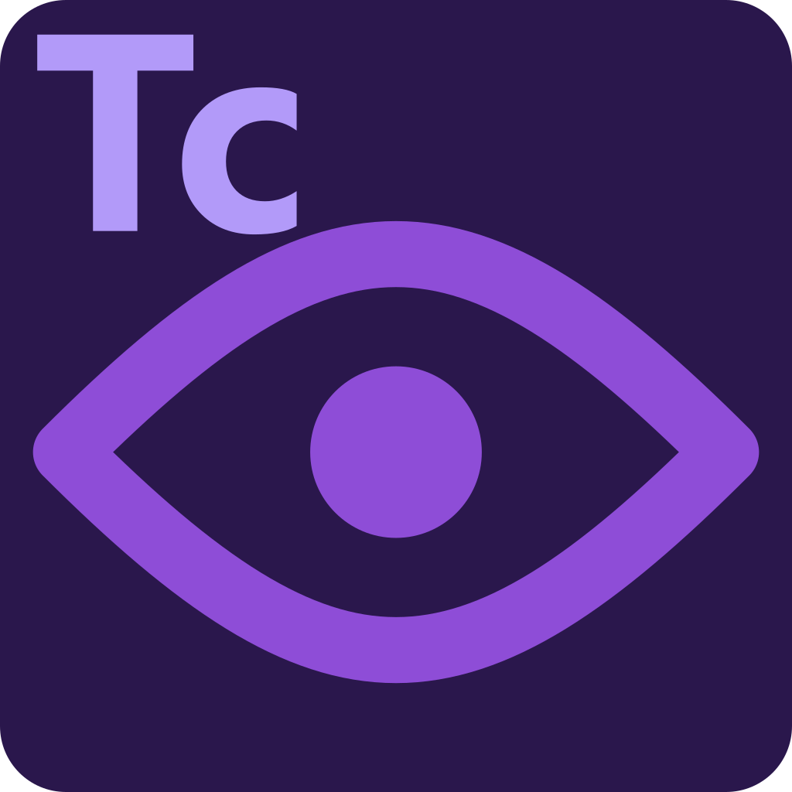

# TcView

  

TcView is a Windows-only VS Code extension for viewing and editing TwinCAT XML-backed PLC source as IEC Structured Text.

It is built as a code-first companion to TwinCAT XAE, not a replacement for it. TcView is strongest when you want faster editing, navigation, diagnostics, metadata inspection, and build workflows from inside VS Code.

## Table Of Contents

- [Overview](#overview)
- [Current Status](#current-status)
- [Why TcView](#why-tcview)
- [Key Features](#key-features)
- [Quick Start](#quick-start)
- [Screenshots](#screenshots)
- [Common Workflows](#common-workflows)
- [Supported Roots](#supported-roots)
- [Supported File Types](#supported-file-types)
- [Install](#install)
- [Bundled Backend](#bundled-backend)
- [Key Settings](#key-settings)
- [Library Metadata](#library-metadata)
- [Documentation](#documentation)
- [License](#license)

## Overview

### What TcView Is

- An ST-first editor for TwinCAT XML-backed PLC source files
- A TwinCAT-aware explorer for valid TwinCAT solutions and PLC project roots
- A navigation and diagnostics tool for TwinCAT source authoring
- A quick way to inspect libraries and build the active TwinCAT solution from VS Code

### What TcView Is Not

- Not a full TwinCAT XAE replacement
- Not a device or configuration engineering environment
- Not a runtime administration or online-debugging workstation

Use TcView for day-to-day code work. Use TwinCAT XAE for device engineering, activation, deployment, runtime control, and full compiler/runtime truth.

## Current Status

TcView is currently in public alpha.

- Windows only
- Built for TwinCAT development workflows inside VS Code
- Intended for real project use, with some features still best treated as alpha-quality edge cases

## Why TcView

- Edit TwinCAT XML-backed source as readable Structured Text instead of raw XML
- Work from a TwinCAT-aware Explorer grouped into `SYSTEM`, `PLC`, and `I/O`
- Keep diagnostics, navigation, and library inspection close to the code
- Build the active TwinCAT solution without leaving VS Code

## Key Features

- Open supported TwinCAT XML artifacts as editable Structured Text
- Save ST changes back into the original TwinCAT XML source
- Browse TwinCAT projects grouped into `SYSTEM`, `PLC`, and `I/O`
- Create TwinCAT files and folders from the Explorer
- Rename, delete, copy, cut, and paste supported TwinCAT items
- Add methods, properties, actions, and transitions for supported POU-like files
- Show diagnostics on files, folders, and top-level Explorer groups
- Navigate with completion, hover, rename, references, symbols, folding, and code actions
- Show per-PLC `References` and open library references in an API-style viewer
- Resolve libraries from project, `.tmc`, managed-library, built-in, and user metadata layers
- Import library project metadata from a selected `.plcproj` or project folder
- Update, remove, and prune user library metadata entries
- Use optional Automation Interface-backed commands to add or remove TwinCAT library references
- Build the active TwinCAT solution with MSBuild
- Export runtime performance baselines and traces for troubleshooting

## Quick Start

1. Open a real TwinCAT root:
   a solution root with `.sln` plus `.tsproj` or `.tspproj`, or a standalone PLC project root with `.plcproj`.
2. Open the `TcView` activity bar container in VS Code.
3. Use the `Explorer` view to browse `SYSTEM`, `PLC`, and `I/O`.
4. Open supported TwinCAT source files and edit them as Structured Text.
5. Save normally to write changes back into the original TwinCAT XML file.

## Screenshots

Screenshot assets are being finalized for the public repo.

The main UI surfaces to expect are:

- the `TcView` Explorer with `SYSTEM`, `PLC`, and `I/O` grouping
- Structured Text editing for TwinCAT XML-backed source files
- library-reference inspection in the API-style viewer

## Common Workflows

- Open `.TcPOU`, `.TcPRG`, `.TcDUT`, `.TcGVL`, `.TcITF`, `.TcIO`, and related artifacts as ST
- Edit them in a code-first view instead of raw TwinCAT XML
- Save changes back to the original TwinCAT source file
- Expand PLC project nodes and folders
- Inspect `References`
- Open a library reference in the API-style viewer
- Create TwinCAT folders and files
- Add methods, properties, actions, and transitions where supported
- Rename, delete, copy, cut, and paste supported items
- Review diagnostics in the editor and Explorer
- Use completion, hover, rename, references, symbols, and code actions
- Suppress selected lint rules with supported `tcview` and Beckhoff analysis pragmas
- Run `Build TwinCAT Solution`
- Export runtime telemetry with `Export TcView Performance Baseline`
- Export traces with `Export TcView Performance Trace`

## Supported Roots

TcView activates on real TwinCAT roots only.

- TwinCAT solution root:
  - contains `.sln` plus `.tsproj` or `.tspproj`
- Standalone PLC project root:
  - contains `.plcproj`

A plain `.sln` without a `.tsproj` or `.tspproj` is not treated as a TwinCAT solution.

## Supported File Types

| Type | Extension |
| --- | --- |
| POU | `.TcPOU` |
| Global Variable List | `.TcGVL` |
| Data Type | `.TcDUT` |
| Program | `.TcPRG` |
| Application | `.TcAPP` |
| Communication | `.TcCOM` |
| Variable Container | `.TcVAR` |
| I/O | `.TcIO` |
| Interface | `.TcITF` |

## Install

### From VSIX

1. Build or download a `.vsix` package.
2. In VS Code, run `Extensions: Install from VSIX...`.
3. Select the TcView `.vsix`.

### From Source

1. Run `npm install`.
2. Run `npm run compile`.
3. Press `F5` in VS Code.

## Bundled Backend

Most TcView features run entirely inside the VS Code extension host.

The bundled backend is only required for TwinCAT Automation Interface operations such as:

- `Add TwinCAT Library To Project`
- `Remove TwinCAT Library From Project`

Important notes:

- The packaged extension ships with a bundled backend.
- The bundled backend currently targets `net8.0-windows`.
- `twincat.backend.executablePath` is an advanced override, not a normal setup step.
- If the backend cannot launch, verify the required .NET runtime is installed and capture the exact error text.

## Key Settings

| Setting | Purpose |
| --- | --- |
| `twincat.build.msbuildPath` | Explicit MSBuild path override |
| `twincat.backend.tmcRoots` | Additional `.tmc` lookup roots |
| `twincat.library.managedRoots` | Additional Managed Libraries roots |
| `twincat.library.metadataFiles` | Additional library metadata JSON files |
| `twincat.backend.executablePath` | Optional override path for a custom TcView backend executable |

## Library Metadata

TcView resolves libraries from several sources in order of confidence:

1. Project or local source
2. Current PLC `.tmc`
3. Installed managed-library metadata
4. Built-in catalog metadata
5. User or workspace metadata

In practice:

- some core Beckhoff libraries already ship with built-in metadata
- project-local or internal libraries usually need manual metadata import from source
- `.tmc` reflects what the current consuming project has compiled or exposed, not a complete external library catalog

Global user metadata lives at:

- `%APPDATA%\\TcView\\tcview.libraries.json`

For more detail, see [Library Metadata](docs/library-metadata.md).

## Documentation

- [Architecture](docs/architecture.md)
- [Library Metadata](docs/library-metadata.md)
- [Lint Pragmas](docs/lint-pragmas.md)
- [Development](docs/development.md)
- [Performance Baselines](docs/performance-baselines.md)
- [Performance Trace Triage](docs/performance-trace-triage.md)
- [Production Readiness](docs/production-readiness.md)
- [GitFlow](docs/gitflow.md)
- [Roadmap](docs/roadmap.md)
- [Contributing](docs/contributing.md)
- [Security Policy](docs/security.md)
- [Code of Conduct](docs/code-of-conduct.md)
- [Changelog](CHANGELOG.md)

## License

MIT. See [LICENSE](LICENSE).
