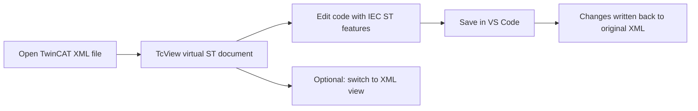

# TcView

TcView is a VS Code extension that lets you work with TwinCAT XML artifacts as IEC 61131-3 Structured Text (ST), so you can read, navigate, and edit PLC logic in a developer-friendly ST view while preserving XML source compatibility.

## New To VS Code

If you are a controls engineer and not a daily VS Code user, this is the main idea:

- Open your TwinCAT XML file in TcView.
- Edit the logic as normal ST text.
- Press `Ctrl+S` to save.
- TcView writes the changes back to the original XML file.

You do not need to run terminal commands for normal editing.

## Why TcView

- Work in ST instead of raw XML wrappers for day-to-day logic editing.
- Jump directly into methods, property accessors, actions, and transitions.
- Keep TwinCAT files as the source of truth while editing through a virtual ST layer.
- Get built-in language assistance (diagnostics, completion, hover, formatting, navigation, code actions).

## Supported Files

TcView supports these TwinCAT XML file types:

| Type | Extension |
| --- | --- |
| POU | `.TcPOU` |
| Global Variable List | `.TcGVL` |
| Data Type | `.TcDUT` |
| Program | `.TcPRG` |
| Application | `.TcAPP` |
| Communication | `.TcCOM` |
| Variable Container | `.TcVAR` |
| Global Data Set | `.TcGDS` |
| I/O | `.TcIO` |
| Interface | `.TcITF` |

## Core Workflow



## First 10 Minutes

1. Open VS Code.
2. Open your project folder (`File` -> `Open Folder...`).
3. In Explorer, right-click a `.TcPOU`/`.TcPRG`/other supported file and choose `Open in TcView`.
4. Edit logic in the ST editor tab.
5. Press `Ctrl+S` to save.
6. If needed, run `Switch TcView View` from Command Palette to compare with raw XML.

Command Palette shortcut:

- Press `Ctrl+Shift+P`
- Type part of a command name (example: `Validate TcView ST Syntax`)

## Features In Detail

- ST-first editing:
  Open supported TwinCAT XML artifacts directly in ST form. TcView handles conversion between XML structure and editable ST content.
- Fragment-aware navigation:
  Browse and open POU internals from the TcView tree (methods, properties, `GET`/`SET`, actions, transitions) without manual XML traversal.
- Seamless save-back:
  Standard save (`Ctrl+S`) in the ST view persists updates to the original XML file.
- Language tooling:
  IEC ST diagnostics and productivity features are available while editing: completion, hover, formatting, code actions, symbol navigation, and indexing.
- Operational diagnostics:
  Optional command-level status/performance tools help with troubleshooting large projects or language-feature behavior.

## Install

### From Source

1. Clone the repository.
2. Run `npm install`.
3. Run `npm run compile`.
4. Press `F5` in VS Code to launch an Extension Development Host.

### Package for Distribution

1. Install VSCE: `npm install -g @vscode/vsce`
2. Build package: `vsce package`
3. Install generated `.vsix` in VS Code.

## Usage

1. Open a workspace containing supported TwinCAT XML files.
2. Open a file from the TcView activity bar tree (`TcView Files`), or from Explorer context menu (`Open in TcView`).
3. Edit logic in ST view.
4. Save in VS Code to persist changes back to XML.
5. Use `Switch TcView View` when you need to inspect raw XML temporarily.

## Typical Tasks

### Edit A POU Implementation

1. Open the `.TcPOU` file in TcView.
2. Find the method/property/action you need in the TcView tree.
3. Make ST changes.
4. Save with `Ctrl+S`.

### Check For ST Issues Before Commit

1. Open Command Palette (`Ctrl+Shift+P`).
2. Run `Validate TcView ST Syntax`.
3. Review reported issues and fix them.

### Confirm Language Features Are Active

1. Open Command Palette (`Ctrl+Shift+P`).
2. Run `Check TcView Language Status`.
3. Use `Show TcView Index Statistics` if navigation/completion seems incomplete.

## Command Reference

Most users do not need to run commands manually. Primary control is opening files and saving edits. Commands are optional utilities for explicit control, validation, and troubleshooting.

| Command | When to use it | Why it exists |
| --- | --- | --- |
| `tcview.openFromExplorer` | You are in Explorer and want ST view immediately | Forces open through TcView from file context |
| `tcview.openFile` | You open from TcView tree or fragment node | Opens file/fragment (method/property/action/transition) |
| `tcview.refreshFiles` | Tree looks stale after bulk file changes | Rebuilds TcView sidebar view state |
| `tcview.switchToXml` | You need to inspect underlying XML | Toggles between virtual ST and original XML |
| `tcview.saveToXml` | Advanced/manual workflows only | Explicit save pathway beyond normal editor save flow |
| `tcview.validateSyntax` | You want an immediate diagnostics pass | Runs explicit ST validation on demand |
| `tcview.showIndexStats` | Navigation/completion seems incomplete | Shows symbol index sizing and coverage clues |
| `tcview.checkLspStatus` | Language features appear inactive | Confirms status of completion/hover/diagnostics stack |
| `tcview.showPerfStats` | Open/index actions feel slow | Reports performance timing summary |

## Practical Examples

### ST Edit Example

```st
FUNCTION_BLOCK FB_PumpControl
VAR_INPUT
    bStart : BOOL;
END_VAR
VAR_OUTPUT
    bRunning : BOOL;
END_VAR

IF bStart THEN
    bRunning := TRUE;
ELSE
    bRunning := FALSE;
END_IF;
```

Open the owning `.TcPOU` in TcView, edit this logic in ST view, and save. TcView writes the update back into the XML implementation section.

### Quick VS Code Shortcuts

| Action | Shortcut |
| --- | --- |
| Save current file | `Ctrl+S` |
| Open Command Palette | `Ctrl+Shift+P` |
| Find in current file | `Ctrl+F` |
| Go to line | `Ctrl+G` |

### Command Palette Example

Run these from VS Code Command Palette (`Ctrl+Shift+P`) when needed:

```text
Switch TcView View
Validate TcView ST Syntax
Show TcView Index Statistics
Show TcView Performance Stats
```

### Settings Example

Project-level `.vscode/settings.json` snippet:

```json
{
  "twincat.performanceLogging": false,
  "twincat.diagnostics.profile": "balanced",
  "twincat.keywordCasing": "upper",
  "twincat.diagnostics.undefinedVariables": "error",
  "twincat.diagnostics.unusedVariables": "warning"
}
```

## Notes For TwinCAT Users

- TcView is an editing/navigation layer for TwinCAT XML artifacts in VS Code.
- It does not replace TwinCAT build/download/runtime workflows.
- Use TcView for code-centric editing and review; use your normal TwinCAT toolchain for compile/deploy operations.

## Development

- Compile: `npm run compile`
- Unit tests: `npm test`
- Integration tests: `npm run test:integration`

## Repository Docs

- [Contributing](CONTRIBUTING.md)
- [Code of Conduct](CODE_OF_CONDUCT.md)
- [Security Policy](SECURITY.md)
- [Changelog](CHANGELOG.md)
- [Production Readiness Notes](docs/production-readiness.md)

## License

MIT. See [LICENSE](LICENSE).
