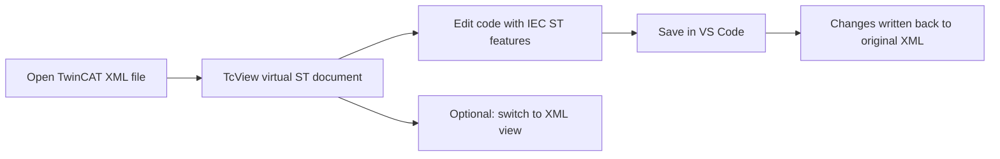

# TcView

TcView is a VS Code extension that lets you work with TwinCAT XML artifacts as IEC 61131-3 Structured Text (ST), so you can read, navigate, and edit PLC logic in a developer-friendly ST view while preserving XML source compatibility.

## Scope

- TcView is a supplemental TwinCAT development tool for VS Code.
- It is intended for code-centric editing, browsing, lightweight inspection, and quick solution builds.
- It is not intended to replace TwinCAT XAE.
- Use TcView alongside XAE, not instead of XAE, when configuration, activation, online change, runtime control, or device engineering is required.

## Platform Support

- TcView is currently supported on Windows only.
- This is intentional. TwinCAT XAE, the Automation Interface, and the practical MSBuild/TwinCAT toolchain are Windows-based.
- The extension manifest is gated to `win32` so it is not offered as a normal install target on non-Windows hosts.

## Runtime Requirements

- Current TcView editing, browsing, library recognition, and library metadata import features run in the VS Code extension host and do not require a persistent backend process.
- If a future backend is added for TwinCAT library-project installation or other XAE-adjacent workflows, its packaging model should be documented explicitly.
- The backend project source in this repo targets `net8.0-windows`, so any backend-enabled release should state whether it is self-contained or framework-dependent.

## New To VS Code

If you are a controls engineer and not a daily VS Code user, this is the main idea:

- Open your TwinCAT XML file in TcView.
- Edit the logic as normal ST text.
- Press `Ctrl+S` to save.
- TcView writes the changes back to the original XML file.

You do not need to run terminal commands for normal editing.

## Why TcView

- Work in ST instead of raw XML wrappers for day-to-day logic editing.
- Jump directly into methods, property accessors, actions, and transitions.
- Browse PLC references in a dedicated library viewer sourced from project `.tmc` metadata.
- Enrich library references with installed TwinCAT Managed Libraries metadata when available.
- Fall back to built-in and workspace library metadata catalogs when a project `.tmc` does not yet expose a referenced library API.
- Open TwinCAT solutions or project roots directly from the TcView sidebar.
- Keep TwinCAT files as the source of truth while editing through a virtual ST layer.
- Get built-in language assistance (diagnostics, completion, hover, formatting, navigation, code actions).

## Supported Files

TcView supports these TwinCAT XML file types:

| Type | Extension |
| --- | --- |
| POU | `.TcPOU` |
| Global Variable List | `.TcGVL` |
| Data Type | `.TcDUT` |
| Program | `.TcPRG` |
| Application | `.TcAPP` |
| Communication | `.TcCOM` |
| Variable Container | `.TcVAR` |
| Global Data Set | `.TcGDS` |
| I/O | `.TcIO` |
| Interface | `.TcITF` |

## Core Workflow



## First 10 Minutes

1. Open VS Code.
2. Open your project folder (`File` -> `Open Folder...`).
3. In Explorer, right-click a `.TcPOU`/`.TcPRG`/other supported file and choose `Open in TcView`.
4. Edit logic in the ST editor tab.
5. Press `Ctrl+S` to save.
6. If needed, run `Switch TcView View` from Command Palette to compare with raw XML.

Command Palette shortcut:

- Press `Ctrl+Shift+P`
- Type part of a command name (example: `Validate TcView ST Syntax`)

## Features In Detail

- ST-first editing:
  Open supported TwinCAT XML artifacts directly in ST form. TcView handles conversion between XML structure and editable ST content.
- Fragment-aware navigation:
  Browse and open POU internals from the TcView tree (methods, properties, `GET`/`SET`, actions, transitions) without manual XML traversal.
- Solution-aware project tree:
  TcView groups content into `SYSTEM`, `PLC`, and `I/O`, hides transient/internal folders, and exposes per-PLC `References` nodes.
- Library viewer:
  Open a reference from the TcView tree to inspect available function blocks, data types, functions, variables, and published members in an API-style webview. When available, TcView also enriches the library view with local Managed Libraries metadata such as vendor, version, install path, and dependency names.
- Metadata-backed library recognition:
  When a referenced library is not yet represented in the current PLC project's `.tmc`, TcView can still recognize common libraries from a built-in catalog, a per-user global metadata file, and optional additional metadata files.
  The built-in catalog now includes a broader Beckhoff seed with category and product metadata, and custom library APIs can be stored once per machine for reuse across TwinCAT projects.
- Library project metadata import:
  Import a TwinCAT library project's internal types, FBs, functions, programs, and variables into TcView's global metadata catalog so linting, completion, and reference checking can recognize the library before a consuming PLC project's `.tmc` exposes it.
- Seamless save-back:
  Standard save (`Ctrl+S`) in the ST view persists updates to the original XML file.
- Language tooling:
  IEC ST diagnostics and productivity features are available while editing: completion, hover, formatting, code actions, symbol navigation, and indexing.
- Solution build:
  Build the active TwinCAT solution with `MSBuild` directly from the TcView UI.
- Operational diagnostics:
  Optional command-level status/performance tools help with troubleshooting large projects or language-feature behavior.

## Install

### From Source

1. Clone the repository.
2. Run `npm install`.
3. Run `npm run compile`.
4. Press `F5` in VS Code to launch an Extension Development Host.

### Package for Distribution

1. Install VSCE: `npm install -g @vscode/vsce`
2. Build package: `vsce package`
3. Install generated `.vsix` in VS Code.

## Usage

1. Open a workspace containing supported TwinCAT XML files.
2. Open a file from the TcView activity bar tree (`TcView Files`), or from Explorer context menu (`Open in TcView`).
3. Edit logic in ST view.
4. Save in VS Code to persist changes back to XML.
5. Use `Switch TcView View` when you need to inspect raw XML temporarily.
6. Open a `References` item from the TcView tree when you need a project-scoped library API view.

## Typical Tasks

### Edit A POU Implementation

1. Open the `.TcPOU` file in TcView.
2. Find the method/property/action you need in the TcView tree.
3. Make ST changes.
4. Save with `Ctrl+S`.

### Check For ST Issues Before Commit

1. Open Command Palette (`Ctrl+Shift+P`).
2. Run `Validate TcView ST Syntax`.
3. Review reported issues and fix them.

### Confirm Language Features Are Active

1. Open Command Palette (`Ctrl+Shift+P`).
2. Run `Check TcView Language Status`.
3. Use `Show TcView Index Statistics` if navigation/completion seems incomplete.

## Command Reference

Most users do not need to run commands manually. Primary control is opening files and saving edits. Commands are optional utilities for explicit control, validation, and troubleshooting.

| Command | When to use it | Why it exists |
| --- | --- | --- |
| `tcview.openFromExplorer` | You are in Explorer and want ST view immediately | Forces open through TcView from file context |
| `tcview.openFile` | You open from TcView tree or fragment node | Opens file/fragment (method/property/action/transition) |
| `tcview.openLibraryReference` | You select a library under `References` | Opens the project-scoped library API viewer |
| `tcview.refreshFiles` | Tree looks stale after bulk file changes | Rebuilds TcView sidebar view state |
| `tcview.switchToXml` | You need to inspect underlying XML | Toggles between virtual ST and original XML |
| `tcview.buildSolutionWithMsBuild` | You want a quick solution build from VS Code | Builds the active TwinCAT solution with MSBuild |
| `tcview.validateSyntax` | You want an immediate diagnostics pass | Runs explicit ST validation on demand |
| `tcview.showIndexStats` | Navigation/completion seems incomplete | Shows symbol index sizing and coverage clues |
| `tcview.checkLspStatus` | Language features appear inactive | Confirms status of completion/hover/diagnostics stack |
| `tcview.showPerfStats` | Open/index actions feel slow | Reports performance timing summary |
| `tcview.showLibraries` | You want a flat detected-library list | Dumps resolved library refs for inspection |
| `tcview.createLibraryMetadataTemplate` | You want to start the global TcView metadata catalog | Creates `%APPDATA%\\TcView\\tcview.libraries.json` and opens it |
| `tcview.importLibraryMetadata` | You have a local managed library folder/package to seed metadata from | Imports vendor/version/dependencies into the global TcView metadata catalog |
| `tcview.importLibraryProjectMetadata` | You have a TwinCAT library project source tree | Extracts internal library metadata from the selected `.plcproj` or library project folder and updates the global TcView metadata catalog |
| `tcview.installLibraryProject` | You want TwinCAT itself to install a library project | Uses the TwinCAT Automation Interface to save/install the selected library project |
| `tcview.addLibraryReference` | You want to reference an installed or known library from a PLC project | Uses the TwinCAT Automation Interface to add a library reference to the selected PLC project |
| `tcview.removeLibraryReference` | You want to remove a library already listed under `References` | Uses the TwinCAT Automation Interface to remove that library reference from the PLC project |

## Practical Examples

### ST Edit Example

```st
FUNCTION_BLOCK FB_PumpControl
VAR_INPUT
    bStart : BOOL;
END_VAR
VAR_OUTPUT
    bRunning : BOOL;
END_VAR

IF bStart THEN
    bRunning := TRUE;
ELSE
    bRunning := FALSE;
END_IF;
```

Open the owning `.TcPOU` in TcView, edit this logic in ST view, and save. TcView writes the update back into the XML implementation section.

### Quick VS Code Shortcuts

| Action | Shortcut |
| --- | --- |
| Save current file | `Ctrl+S` |
| Open Command Palette | `Ctrl+Shift+P` |
| Find in current file | `Ctrl+F` |
| Go to line | `Ctrl+G` |

### Command Palette Example

Run these from VS Code Command Palette (`Ctrl+Shift+P`) when needed:

```text
Switch TcView View
Build TwinCAT Solution
Validate TcView ST Syntax
Show TcView Index Statistics
Show TcView Performance Stats
Create TcView Global Library Metadata File
Import TwinCAT Library Metadata
Import TwinCAT Library Project Metadata
Install TwinCAT Library Project
Add TwinCAT Library To Project
Remove TwinCAT Library From Project
```

### Settings Example

Project-level `.vscode/settings.json` snippet:

```json
{
  "twincat.performanceLogging": false,
  "twincat.library.metadataFiles": [
    ".vscode/tcview.libraries.json"
  ],
  "twincat.diagnostics.profile": "balanced",
  "twincat.keywordCasing": "upper",
  "twincat.diagnostics.undefinedVariables": "error",
  "twincat.diagnostics.unusedVariables": "warning"
}
```

### Global Library Metadata Example

TcView stores user-added library metadata in a per-user global file at `%APPDATA%\TcView\tcview.libraries.json`.
You can also point `twincat.library.metadataFiles` at additional project-specific JSON files when you need overrides.

For TwinCAT build `4026` and later, you can model virtual global type libraries generated beneath `Tc3_GlobalTypes` by setting `"virtualParent": "Tc3_GlobalTypes"` on a library entry. TcView treats those entries as implicit system-global libraries when resolving types.

```json
{
  "libraries": [
    {
      "name": "MyCompanyLib",
      "vendor": "My Company",
      "version": "1.2.0",
      "infoUrl": "https://example.invalid/docs/mycompanylib",
      "dependencies": ["Tc2_System"],
      "functionBlocks": [
        {
          "name": "FB_Device",
          "documentation": "Metadata-backed function block shape.",
          "members": {
            "bEnable": "BOOL",
            "bReady": "BOOL"
          }
        }
      ],
      "dataTypes": [
        {
          "name": "ST_DeviceConfig",
          "kind": "struct",
          "members": {
            "sName": "STRING",
            "nTimeoutMs": "UDINT"
          }
        }
      ]
    },
    {
      "name": "MyNamespace_GlobalTypes",
      "virtualParent": "Tc3_GlobalTypes",
      "dataTypes": [
        {
          "name": "ST_SystemWideConfig",
          "kind": "struct",
          "members": {
            "bEnabled": "BOOL"
          }
        }
      ]
    }
  ]
}
```

## Notes For TwinCAT Users

- TcView is an editing/navigation layer for TwinCAT XML artifacts in VS Code.
- TcView is Windows-only by design, aligned with TwinCAT XAE tooling constraints.
- It currently exposes solution build only, not full TwinCAT XAE runtime operations.
- Library API views are derived from the current PLC project's `.tmc` and may be partial/project-scoped rather than a full library catalog.
- Installed TwinCAT Managed Libraries metadata is used as a local enrichment source for library vendor/version/dependency details, but not as the primary API truth source.
- Built-in, global, and optional project-specific metadata catalogs can provide earlier library recognition before a PLC build produces the relevant `.tmc`, but those metadata-backed APIs are not compiler-validated project truth.
- `Tc3_GlobalTypes` is treated specially. TcView now models the always-available system global type library and the post-build-4026 virtual child libraries such as `Tc3_GlobalTypes_Global` and metadata entries declared with `virtualParent: "Tc3_GlobalTypes"`.
- The API-backed install/add/remove library commands require a valid TwinCAT solution context and a working TwinCAT Automation Interface registration on the machine.
- TcView is intentionally a supplemental tool, not a full XAE replacement.
- Use TcView for code-centric editing, review, and lightweight project inspection; use TwinCAT XAE for full runtime/configuration workflows.

## Development

- Compile: `npm run compile`
- Unit tests: `npm test`
- Integration tests: `npm run test:integration`

## Repository Docs

- [Contributing](CONTRIBUTING.md)
- [Code of Conduct](CODE_OF_CONDUCT.md)
- [Security Policy](SECURITY.md)
- [Changelog](CHANGELOG.md)
- [Production Readiness Notes](docs/production-readiness.md)

## License

MIT. See [LICENSE](LICENSE).
